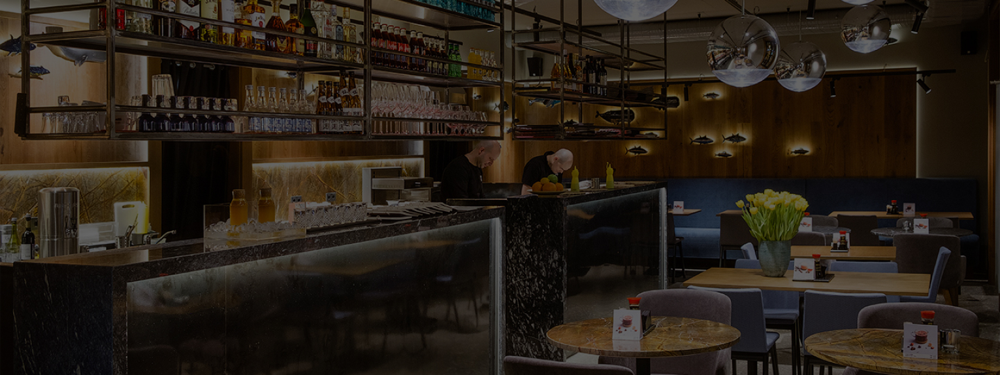

#Верстка сайту
##Сайт було створено для суші-бару "Асахі"  

 
###Мета сайту   
- розвиток бізнесу (в цьому випадку суші-бару) 
- реклама та просування продукту  
###Задачі сайту  
- привабити нових клієнтів, 
- надати їм усю необхідну інформацію і контакти, 
- зробити замовлення продукту максимально простим і 
доступним для кожного, "змусити" замовити
  
- зробити інтерфейс приємним та інтуїтивно зрозумілим

##Сайт складається з трьох сторінок :
- лендінг  
- сторінка-контейнер  
- інформаційна сторінка  

Було зроблено адаптивну верстку для десктопної, 
планшетної та мобільної версій. Для зручності було використано
grid-модуль css-фреймворка Bootstrap (для сітки) та LESS для зручності.
Макет сайту можна переглянути за посиланням нижче  

[Переглянути макет](https://www.figma.com/file/FsgKw3ShoMLfscaYECPtz3/asahi?node-id=317%3A0&frame-preset-name=Desktop)
